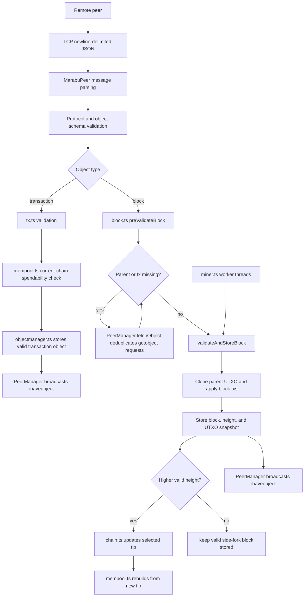

# LedgerGhost Marabu Node

This project is a TypeScript/Bun implementation of a Marabu blockchain node for the **Blockchain Foundations** course at the **National Technical University of Athens (NTUA)**. It was built to participate in the Marabu network (designed for this course), not as a generic cryptocurrency node. The implementation follows the course protocol: newline-delimited JSON over TCP, content-addressed application objects, BLAKE2s object IDs, Ed25519 transaction signatures, a UTXO ledger model, static-difficulty proof-of-work, mempool support, chain-tip synchronization, and optional mining.

Overall, the project is designed to act as a full protocol participant: it accepts inbound peers, opens outbound peer connections, exchanges known peers, stores and serves objects, validates transactions and blocks, follows the longest locally validated chain, maintains UTXO snapshots for forks, rebuilds the mempool after reorganizations, and can mine blocks with configured NTUA student IDs.

Protocol reference: [Marabu protocol](https://www.marabu.dev/protocol)

## Course Context

Because this repository was developed for NTUA's Blockchain Foundations class, some constants are intentionally hardcoded such as:

- Protocol compatibility: `0.10.x`
- Default TCP port: `18018`
- Required block target: `00000000abc00000000000000000000000000000000000000000000000000000`
- Genesis block ID: `00000000522473196b73bc619a8b18472c4cb4c6caf785a13fa32aaae7222ff6`
- Genesis block contents in `src/net/serve.ts`
- Bootstrap peer addresses in `src/conf.ts`

Those values should not be treated as generic magic numbers.

## Important notice

- `src/conf.ts` contains hardcoded bootstrap peer IPs for the Marabu class network.
- `src/net/serve.ts` and `src/block.ts` contain the hardcoded genesis block, genesis ID, and required proof-of-work target.

The hardcoded protocol, genesis, target, and bootstrap peer values are expected for this course project.


## High-Level File Guide

### `src/index.ts`

Application entry point. It logs the node identity, validates the Bun version when running under Bun, installs fatal error handlers for uncaught exceptions and unhandled promise rejections, and then starts the node through `run()` from `src/net/serve.ts`.

### `src/conf.ts`

Central runtime configuration. It uses Zod to parse and validate environment variables:

- Server binding: `SERVER_HOST`, `SERVER_PORT`
- Node identity: `AGENT_NAME`, `AGENT_VERSION`, `AGENT_AUTHOR`
- Peer discovery: `IP_RETRIEVAL_SERVICE`, `TARGET_NUM_CONNECTIONS`, `PEERS_FILE`, `BOOTSTRAP_PEERS`, `MAX_PEERS_PER_NEIGHBOUR`
- Logging: `LOG_LEVEL`
- Mining: `MINING_ENABLED`, `MINER_STUDENT_IDS`, `MINER_REWARD_PUBKEY`, `MINER_NOTE`, `MINER_MINE_EMPTY_BLOCKS`, `MINER_WORKERS`, `MINER_BATCH_SIZE`, `MINER_TEMPLATE_REFRESH_MS`, `MINER_STATUS_INTERVAL_MS`, `MINER_NONCE_HEX_CHARS`

The bootstrap peers are hardcoded defaults because the node is meant to join the course Marabu network.

### `src/log.ts`

Creates the shared Pino logger. All modules use this logger so verbosity can be controlled through `LOG_LEVEL`.

### `src/db.ts`

Wraps LevelDB access behind a small async API. The database path is hardcoded as `./objectdb`, relative to the process working directory. This matters in PM2 and server deployments.

Exposed operations include `has`, `get`, `put`, `del`, `keys`, and `close`.

### `src/objects.ts`

Defines Zod schemas and TypeScript types for Marabu application objects:

- Regular transactions with `inputs` and `outputs`
- Coinbase transactions with `height` and `outputs`
- Blocks with `txids`, `nonce`, `previd`, `created`, target `T`, optional `miner`, optional `note`, and optional `studentids`

This file is the schema boundary for the blockchain object model.

### `src/crypto.ts`

Implements cryptographic helpers:

- Canonical JSON object hashing with BLAKE2s
- Ed25519 signature verification
- Hex/byte conversion re-exports

Transaction signatures are checked against the canonical transaction body with every input signature set to `null`, matching the course protocol.

### `src/objectmanager.ts`

Stores and retrieves accepted protocol objects by object ID. Object IDs are computed as BLAKE2s hashes over canonical JSON.

It also exposes:

- `validateObject()` for high-level object validation
- `hash()` for canonical object ID calculation
- raw object retrieval for block validation and chain reconstruction

Blocks are only lightly accepted at the generic object layer; full block validation happens in `src/block.ts`.

### `src/tx.ts`

Validates transaction semantics. The validator supports two modes:

- Object-reference validation, where inputs resolve to previously stored transaction outputs.
- UTXO-backed validation, where inputs must be spendable in a provided UTXO set.

It checks transaction format, duplicate inputs, referenced output existence, signatures, and weak conservation of value.

### `src/utxo.ts`

Defines the in-memory `UTXOSet` abstraction and persistence helpers. Every validated block can have:

- A serialized UTXO snapshot under `utxo:<blockid>`
- A persisted height under `height:<blockid>`

This design makes fork validation efficient because a new block can clone its parent's UTXO snapshot instead of replaying the entire chain.

### `src/chain.ts`

Maintains the selected chain tip and blocktree metadata. It:

- Loads and repairs the stored chain tip
- Selects the highest locally validated block as fallback
- Updates the local tip only when a valid block has greater height
- Identifies transactions disconnected during a reorganization

The node uses a longest-valid-chain rule, not a "latest received block wins" rule.

### `src/block.ts`

Validates and stores blocks. Validation includes:

- Canonical hashability
- Strict block schema
- Required class-network target
- Genesis identity
- Proof of work
- Future timestamp rejection
- Parent lookup and recursive parent validation
- Parent timestamp ordering
- Transaction lookup, validation, and storage
- Coinbase position, height, and reward rules
- UTXO application
- Fee accounting

On success it stores the block, saves the block height, and persists the resulting UTXO set. The validator accepts an injected object fetcher so networking can supply missing parents or transactions without mixing socket logic into consensus logic.

### `src/mempool.ts`

Tracks transactions spendable on the current longest-chain UTXO view. It keeps two related sets:

- The active mempool, reported to peers through `getmempool`
- Candidate transaction IDs that may become spendable after a reorg

The mempool is rebuilt when the chain tip changes. Coinbase transactions and side-fork-only spends may be stored as objects, but they are not reported as current-chain mempool transactions unless they are spendable from the selected tip.

### `src/miner.ts`

Builds and mines candidate blocks when `MINING_ENABLED=true`. The miner:

- Requires `MINER_STUDENT_IDS`
- Rebuilds the mempool before creating a block template
- Mines on top of the current selected chain tip
- Optionally creates a coinbase transaction paying `MINER_REWARD_PUBKEY`
- Includes configured `studentids`
- Uses worker threads to search nonce space without blocking peer networking
- Validates and stores found blocks through the normal block-validation path
- Broadcasts newly accepted blocks with `ihaveobject`

The miner does not bypass consensus. A locally mined block must pass the same `validateAndStoreBlock()` path as a block received from the network.

### `src/net/protocol.ts`

Defines the wire-message schemas and TypeScript types for the Marabu peer protocol:

- `hello`
- `error`
- `getpeers`
- `peers`
- `getobject`
- `ihaveobject`
- `object`
- `getmempool`
- `mempool`
- `getchaintip`
- `chaintip`

The file also re-exports application object types under protocol-facing names.

### `src/net/peer.ts`

Implements generic TCP transport for newline-delimited JSON messages. It handles buffering, line splitting, JSON parsing, canonical JSON serialization, and socket writes. Protocol-specific behavior is delegated to `MarabuPeer`.

### `src/net/util.ts`

Contains peer-address utilities. It parses `host:port` strings, supports IPv4/IPv6/hostnames, normalizes IP storage, validates ports, resolves hostnames, and helps reject private addresses during peer discovery.

### `src/net/peermanager.ts`

Manages peer-level shared state:

- Active peer connections
- Known peer addresses
- Candidate objects currently under validation
- Object source tracking
- Deduplicated object fetches
- Deferred `getobject` responses while a requested object is still being validated
- Peer cache persistence in `peers.json`

It is the coordination layer between individual peer connections and the rest of the node.

### `src/net/marabupeer.ts`

Implements the Marabu protocol state machine for one peer connection. It handles:

- Handshake validation and protocol version compatibility
- Peer discovery
- Object advertisement and retrieval
- Object parsing and validation dispatch
- Mempool requests
- Chain-tip requests and recursive sync
- Block gossip after acceptance
- Error responses and disconnect policy

This file is the bridge between networking, consensus validation, object storage, mempool maintenance, and chain-tip updates.

### `src/net/serve.ts`

Bootstraps the running node. It verifies and stores the genesis block, initializes genesis UTXO and height metadata, restores known peers, discovers the node's public IP, starts the TCP server, opens outbound peer connections, and starts the miner if mining is enabled.

## How the Node Works

At runtime the node behaves as a long-running TCP service.

1. Startup begins in `src/index.ts`.
2. Configuration is loaded from environment variables by `src/conf.ts`.
3. `src/net/serve.ts` verifies the course genesis block and initializes local LevelDB state.
4. The node restores or creates `peers.json`.
5. A TCP server starts on `SERVER_HOST:SERVER_PORT`.
6. `PeerManager` opens outbound connections until `TARGET_NUM_CONNECTIONS` is reached.
7. Each connection is represented by `MarabuPeer`.
8. Peers exchange `hello`, `getpeers`, and `getchaintip` messages.
9. Objects are exchanged through `ihaveobject`, `getobject`, and `object`.
10. Transactions are validated, stored, and admitted to the mempool only if spendable on the current chain tip.
11. Blocks are prevalidated, recursively completed if dependencies are missing, fully validated, stored, and used to update the chain tip if they extend the longest valid chain.
12. When the selected tip changes, the mempool is rebuilt from the new tip's UTXO snapshot.
13. If mining is enabled, worker threads continuously try nonce values for the current block template.
14. Accepted local blocks are stored and gossiped exactly like accepted remote blocks.

## Architecture Diagram

The most important path in the node is the object-validation and block-sync flow. Network code receives candidate objects, but consensus validation decides whether they become stored, served, gossiped, and eligible to affect the selected chain.



## Core Design Logic

### Content-Addressed Objects

Every Marabu application object is identified by the BLAKE2s hash of its canonical JSON representation. This means all participating nodes must serialize objects identically to agree on the same object IDs.

The node uses this rule for:

- Storing objects in LevelDB
- Requesting and serving objects over the network
- Linking blocks to parents
- Linking blocks to transactions
- Checking proof of work

### Strict Boundary Validation

Wire messages are validated with schemas in `src/net/protocol.ts`. Application objects are validated with schemas in `src/objects.ts`. This keeps malformed network input from leaking into consensus logic.

Errors are reported with protocol error names such as `INVALID_FORMAT`, `UNKNOWN_OBJECT`, `UNFINDABLE_OBJECT`, `INVALID_TX_SIGNATURE`, `INVALID_BLOCK_POW`, and `INVALID_GENESIS`.

### Blocktree Instead of Single Chain Storage

The node stores every valid block it receives, not only the selected chain tip. Every valid block gets its own height and UTXO snapshot. Side forks can therefore remain available for future reorganizations or `getobject` responses.

The selected tip is the highest locally validated block. If two competing chains exist, the node keeps both in storage but exposes mempool state relative to the selected tip.

### UTXO Snapshots

Each valid block has a persisted UTXO set after applying that block. A child block clones its parent's UTXO set and applies its own transactions in order.

This makes validation and reorg handling simpler:

- A side fork can be validated from its parent snapshot.
- The mempool can be rebuilt from the selected tip snapshot.
- Transactions can be checked against current-chain spendability.

### Mempool as Current-Chain State

The mempool is not "every valid transaction object." It is the set of non-coinbase transactions that can currently spend outputs from the selected chain tip plus earlier accepted mempool transactions.

This distinction matters for forks. A transaction can be valid as an object because its referenced transaction exists, but still not be valid for the mempool if that output is not spendable on the current selected chain.

### Dependency Fetching

Blocks can arrive before their parent block or before their transactions. The block validator receives an object fetch callback. The networking layer implements that callback with `PeerManager.fetchObject()`, which deduplicates concurrent requests and asks peers that advertised the missing object first.

This keeps consensus logic deterministic while still allowing recursive network sync.

### Mining

Mining is optional and disabled by default. When enabled, the miner builds a block template from the current chain tip and mempool. It searches nonce values in worker threads, then validates any found candidate through the same normal validation path used for remote blocks.

The mining code is tied to the course assignment because it includes configured `studentids` in mined blocks.

## Running Locally

Install dependencies:

```bash
bun install
```

Run directly:

```bash
bun src/index.ts
```

Build and run the bundled output:

```bash
bun run build
bun dist/index.js
```

The code checks for Bun `>=1.3.10` when running under Bun because decorators are used in `src/net/marabupeer.ts`.

## Testing

The public package currently has no committed `test` script in `package.json`. Local regression scripts exist in this workspace for the pset milestones, but they are ignored by the repository-level `.gitignore`, so they should only be published after they are reviewed, deterministic, and stripped of private deployment details.

When those scripts are intentionally kept locally, the normal pattern is:

```bash
bun run build
SERVER_HOST=127.0.0.1 SERVER_PORT=18118 TARGET_NUM_CONNECTIONS=0 BOOTSTRAP_PEERS= bun src/index.ts
```

Then run the relevant regression script in another shell with its expected `TEST_PORT` or default port. For public documentation, prefer committing cleaned test files under a dedicated test directory and adding a package script such as `bun run test`.

## Runtime Configuration

Every supported environment variable is documented in `.env.example`. The example is intentionally safe for local use: it binds to `127.0.0.1`, disables outbound peer bootstrap by default, and leaves mining disabled.

Common local non-mining configuration:

```bash
SERVER_HOST=127.0.0.1
SERVER_PORT=18018
AGENT_NAME=LedgerGhost
AGENT_VERSION=1.0.0
AGENT_AUTHOR="Your Name"
IP_RETRIEVAL_SERVICE=https://ifconfig.me/ip
TARGET_NUM_CONNECTIONS=0
BOOTSTRAP_PEERS=
MAX_PEERS_PER_NEIGHBOUR=8
PEERS_FILE=peers.json
LOG_LEVEL=info
```

Common class-network configuration changes:

```bash
SERVER_HOST=0.0.0.0
TARGET_NUM_CONNECTIONS=8
BOOTSTRAP_PEERS=<instructor-provided-host:port-list>
```

Mining configuration, only when intentionally mining:

```bash
MINING_ENABLED=true
MINER_STUDENT_IDS=<student-id-1>,<student-id-2>
MINER_REWARD_PUBKEY=<64-char-lowercase-hex-public-key>
MINER_NOTE=<optional-ascii-note>
MINER_MINE_EMPTY_BLOCKS=false
MINER_WORKERS=0
MINER_BATCH_SIZE=5000
MINER_TEMPLATE_REFRESH_MS=15000
MINER_STATUS_INTERVAL_MS=5000
MINER_NONCE_HEX_CHARS=64
```

Notes:

- `MINER_STUDENT_IDS` is required when mining is enabled.
- `MINER_REWARD_PUBKEY` is optional. If it is empty, the miner does not create a reward-paying coinbase transaction.
- `MINER_WORKERS=0` auto-selects one fewer than the CPU core count, with a minimum of one worker.
- `MINER_MINE_EMPTY_BLOCKS=false` makes the miner wait for mempool transactions before hashing.
